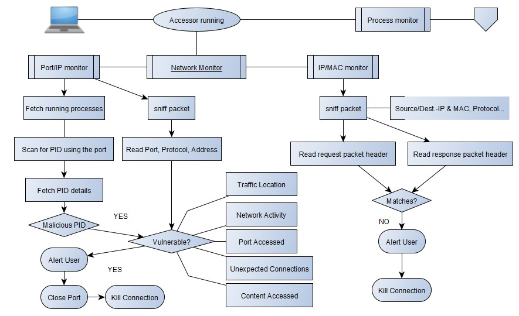
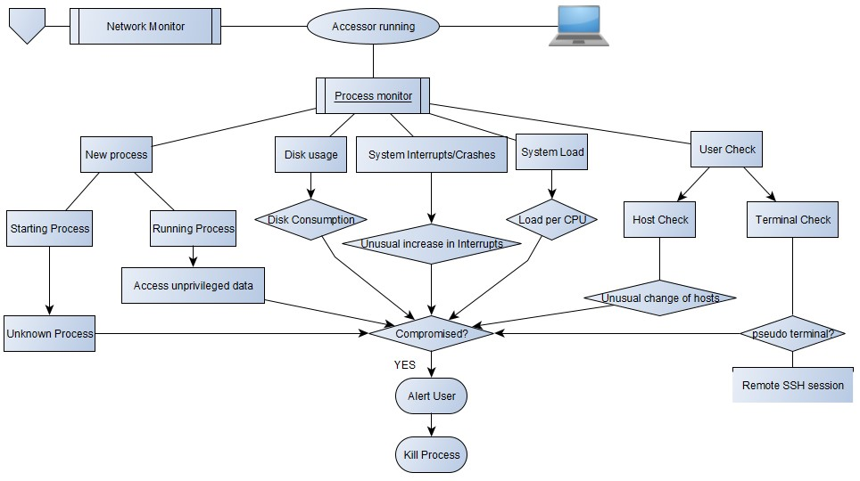

# System-Accessor
The Accessor is divided into two components each executing different sets of function in order to determine whether the system has been compromised or under one at the moment. Unlike the usual antiviruses offered from several companies checking for flags in the files or running the file for a short period in a sandbox, which can easily be bypassed by using redundant code, hiding the files, making the file polymorphic etc. Thus, to add to the current methods of accessing the system, the structure has been developed in two components namely Network Accessor and Process Monitor which works to check the system’s symptoms in order to provide better results.
 

A general compromised system symptoms could be any of the following and several other not mentioned here:
* Unexpected fast consumption of disk.
* System running at exceptionally slow speed
* Unexpected connection by your computer to internet.
* New unknown files running
* Unusual traffic in & out of network
* Suspicious activity in admin or privileged account
* Dubious network activities indication brute force
* Spike in file activities
* Unusual port being accessed by some process
* Network activity from strange geographical areas
* System crashing/Interrupts
* Unusual usage time

## Implementation

### Required Libraries

Import the required libraries using `pip3 install [library_name]`

Required libraries-
* scapy
* time
* pynput
* threading
* smtplib
* colorama
* pyshark
* geocoder
* psutil
* subprocess
* prettytable

